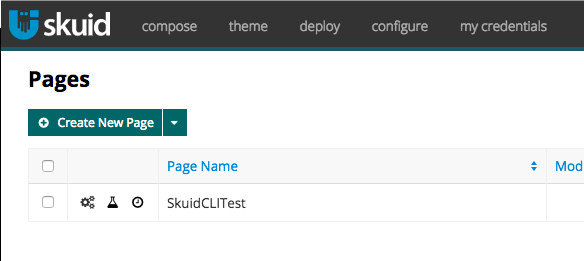

# Version Control with Salesforce - A Primer

This repo will serve as an example of how to implement version control with Salesforce and Skuid. For this tutorial, we'll be using the `force` CLI for interacting with Salesforce metadata, the `skuid` CLI for working with Skuid pages, and `git` for version control. Also, this tutorial assumes that you're working with a new Developer Edition Org with Skuid (9.5.0) installed.

You can find more information about these tools here:

* https://github.com/heroku/force
* https://github.com/skuid/skuid
* https://git-scm.org

## Getting Started

To get started, you'll need to install the tools listed above. You can install `git` via Homebrew or download it from their website. 

To install `force` and `skuid`, run the setup script as follows:

```bash
$ bash bin/setup.sh
```

This script will install these tools for you. To make sure they've installed correctly, run the following commands:

```
$ force --help
$ skuid --help
```

Both of those commands should output information about the commands you can run with them. Once we've verified that they are working, we'll log into Salesforce with `force`. This will allow force to authenticate (via oauth) with Salesforce. To do this, type: 

```bash
$ force login
```

This will open a browser window where you can log into Salesforce. Once it's done you should see the following output:

```bash
$ force login
Logged in as 'ethanfrogers@sfdc-vcs.com' (API v37.0)
```

## Working with the Force CLI

The Force CLI the tool that we'll use for interacting with Salesforce metadata. It allows us to "fetch" metadata out of Salesforce and store a representation of that on our filesystem. Once the data is on our filesystem, we can version control it (more on that later).

One of the main files we care about when working with Salesforce metadata is `src/package.xml`. The `package.xml` file is important because it lists all of the metadata that we care about in the context of our project. If you look at the one in this tutorial, you'll notice that we are listing the `Case` and `Opportunity` objects. 

```xml
<?xml version="1.0" encoding="UTF-8"?>
<Package xmlns="http://soap.sforce.com/2006/04/metadata">
    <types>
        <members>Case</members>
        <members>Opportunity</members>
        <name>CustomObject</name>
    </types>
    <version>39.0</version>
</Package>
```

When we "push" or "fetch" metadata, the `force` tool uses this file as a way of knowing what we care about. In this case, we only care about "fetching" the `Case` and `Opportiunity` objects. All other objects will be left in Salesforce until we decide that we need to include them. Let's see what happens when we "fetch" these objects.

If you look in the `src` folder, you'll see that the only file in it is the `package.xml` file. Next, run the following command:

```
$ force fetch -x src/package.xml
Not done yet: InProgress  Will check again in five seconds.
Exported to demo-team-repo/src
```

Here we're using the `force` command to fetch our metadata, and telling it where to find the `package.xml` file. You'll notice that it said it exported something to our `src` folder. Let's look in that folder and see what it did.

```
$ tree src
src
├── objects
│   ├── Case.object
│   └── Opportunity.object
└── package.xml

1 directory, 3 files
```

Now, there is a folder in our `src` folder that is storing the representation of our `Case` and `Opportunity` objects. If you look at the `src/objects/Case.object` file, you'll see that it's just an XML file defining all of the properties of our `Case` object, including Standard and Custom Fields. Here are the first 10 lines.


```xml
<?xml version="1.0" encoding="UTF-8"?>
<CustomObject xmlns="http://soap.sforce.com/2006/04/metadata">
    <actionOverrides>
        <actionName>Accept</actionName>
        <type>Default</type>
    </actionOverrides>
    <actionOverrides>
        <actionName>CancelEdit</actionName>
        <type>Default</type>
    </actionOverrides>
```

Now, let's include other metadata to see how it affects what we fetch.

In your org, create a Static Resource named `VersionControlDemo` and upload any file you want. Only the name really matters. Then, edit `src/package.xml` so that it looks like this:

```xml
<?xml version="1.0" encoding="UTF-8"?>
<Package xmlns="http://soap.sforce.com/2006/04/metadata">
    <types>
        <members>*</members>
        <members>Case</members>
        <members>Opportunity</members>
        <name>CustomObject</name>
    </types>
    <types>
        <members>VersionControlDemo</members>
        <name>StaticResource</name>
    </types>
    <version>39.0</version>
</Package>
```

You'll notice that we just added a new `type` and told it that we want to fetch the Static Resource named `VersionControlDemo`. We should now be able to run `force fetch -x src/package.xml` again, and see that it now fetches our `Case` and `Opportunity` objects, as well as the new Static Resource.

```bash
$ force fetch -x src/package.xml
Exported to demo-team-repo/src
$ tree src
src
├── objects
│   ├── Case.object
│   └── Opportunity.object
├── package.xml
└── staticresources
    ├── VersionControlDemo.resource
    └── VersionControlDemo.resource-meta.xml

2 directories, 5 files
```

This can be extrapolated to all metadata types within Salesforce. See [this documentation](https://developer.salesforce.com/docs/atlas.en-us.api_meta.meta/api_meta/meta_types_list.htm) for a full list. For more information about how `package.xml` affects what's "pushed" and "fetched", see [this documentation](https://developer.salesforce.com/docs/atlas.en-us.api_meta.meta/api_meta/manifest_samples.htm).

## How does this relate to version control?

Version control is all about the state of a file on your computer at a given point in time. With `git`, we "commit" files which tells `git` "at this point in time, this is what the file should look like". From there, `git` can track any changes to the file, until the next "commit". Once we commit those changes, it's like telling `git` "now at this point in time, the file should look like this". Lets look at an example.

We'll start with our Static Resource that we added in the previous steps. This is what mine looks like: 

```bash
$ cat src/staticresources/VersionControlDemo.resource
This is a tutorial!
```

If we ask `git` to tell us what changes have been made, we'll see that nothing has been done.

```bash
$ git status
On branch master
nothing to commit, working tree clean
```

Now, edit the `src/staticresources/VersionControlDemo.resource` file. Add anything you'd like! I'll edit mine as follows:

```
This is a tutorial! And I love using Git!
```

If we ask `git` about changes again, we'll see that it saw changes to our file.

```bash
$ git status
On branch master
Changes not staged for commit:
  (use "git add <file>..." to update what will be committed)
  (use "git checkout -- <file>..." to discard changes in working directory)

	modified:   src/staticresources/VersionControlDemo.resource

no changes added to commit (use "git add" and/or "git commit -a")
```

Next, we'll "stage" our files for commit. Staging a file tells `git` that the next time I commit, this is how I want the files to look. One note though: if you stage a file and then make some changes, you'll need to re-add that file so that `git` knows about the most recent changes. Now, lets stage our changes.


```bash
$ git add src/staticresources/VersionControlDemo.resource
$ git status
On branch master
Changes to be committed:
  (use "git reset HEAD <file>..." to unstage)

	modified:   src/staticresources/VersionControlDemo.resource
```

The next step is to commit our changes. When we commit, we must include a short message about what we are comitting. This is usually some useful information so that others can look back and see why something was done. It can be helpful for those that come behind you to see your motivation for a change. We'll do this with the following command.

```bash
$ git commit -m "Editing the VersionControlDemo file for the commit step"
[master 05c07dc] Editing the VersionControlDemo file for the commit step
 1 file changed, 1 insertion(+), 1 deletion(-)
```

If we ask `git` for our changes now, we'll see that we're back in a state where there are no changes.

```bash
$ git status
On branch master
nothing to commit, working tree clean
```

There are a lot of features of `git` that aren't covered by this tutorial, but you will be using when working in this environment.


## Using the Skuid CLI

The `skuid` CLI is a simplified version of `force` made specificly for interacting with the Skuid managed package. The great thing about `skuid` is the concepts mentioned above still apply. The CLI is responsible for "pushing" and "pulling" your Skuid pages to & from your filesystem. We can now use the `skuid` command and represent our Skuid pages in version control. Let's see how it works.

As you can see below, I have a Skuid page in my Org called SkuidCLIDemo.



